# **Informe Final — Clasificación de Neumonía en Rayos X usando Descriptores Clásicos**

**Curso:** Visión por Computador II – 3009228  
**Semestre:** 2025-02  
**Facultad de Minas, Universidad Nacional de Colombia**  
**Departamento de Ciencias de la Computación y de la Decisión**  
**Autora:** Daniela Buitrago

---

## **1. Introducción**

El presente trabajo aborda el problema de clasificación automática de neumonía en imágenes de rayos X de tórax utilizando descriptores clásicos de forma y textura, junto con algoritmos de machine learning tradicionales y deep learning.  
La tarea consiste en desarrollar un sistema completo que, a partir de imágenes de rayos X, pueda distinguir entre casos normales y casos con neumonía mediante la extracción de características descriptivas y su posterior clasificación.

Este ejercicio tiene una doble motivación:  
(i) comprender y aplicar técnicas clásicas de visión por computador para análisis de imágenes médicas, y  
(ii) comparar el rendimiento de diferentes descriptores y algoritmos de clasificación en un problema real de diagnóstico asistido por computador.

El proyecto se estructura en tres fases principales: análisis y preprocesamiento de datos, extracción de descriptores clásicos, y clasificación mediante múltiples algoritmos de machine learning.

---

## **2. Marco Teórico**

### **2.1 Descriptores de Forma**

Los descriptores de forma capturan información geométrica y estructural de los objetos en la imagen.

#### **2.1.1 Histogram of Oriented Gradients (HOG)**
HOG (Dalal & Triggs, 2005) representa la distribución local de intensidades de gradiente. Divide la imagen en celdas, calcula histogramas de gradientes orientados en cada celda, y normaliza sobre bloques de celdas. Es robusto a variaciones de iluminación y parcialmente invariante a traslaciones pequeñas.

#### **2.1.2 Momentos de Hu**
Los momentos invariantes de Hu (Hu, 1962) son 7 descriptores derivados de momentos centrales normalizados que son invariantes a traslación, rotación y escala. Se calculan a partir de momentos de imagen:

\[
\eta_{pq} = \frac{\mu_{pq}}{\mu_{00}^{\gamma}}, \quad \gamma = \frac{p+q}{2} + 1
\]

Los 7 momentos de Hu capturan diferentes aspectos de la forma: dispersión espacial, asimetría, elongación y kurtosis.

#### **2.1.3 Descriptores de Contorno**
Los descriptores de contorno caracterizan la forma de los objetos mediante propiedades geométricas:
- **Circularidad**: \(C = \frac{4\pi A}{P^2}\), donde A es el área y P el perímetro
- **Excentricidad**: Medida de elongación basada en elipse ajustada
- **Solidez**: Ratio entre área del contorno y área del casco convexo

#### **2.1.4 Descriptores de Fourier**
Los descriptores de Fourier representan el contorno en el dominio de la frecuencia mediante FFT. La magnitud de los coeficientes es invariante a rotación, y la normalización por el componente DC los hace invariantes a escala.

### **2.2 Descriptores de Textura**

Los descriptores de textura capturan patrones locales y estadísticas de intensidad.

#### **2.2.1 Local Binary Patterns (LBP)**
LBP (Ojala et al., 2002) codifica la textura local comparando cada píxel con sus vecinos. Genera un código binario que se convierte en histograma. Es invariante a cambios monotónicos de iluminación.

#### **2.2.2 Gray Level Co-occurrence Matrix (GLCM)**
GLCM (Haralick et al., 1973) analiza la distribución espacial de pares de píxeles. Se calculan propiedades estadísticas como:
- **Contraste**: Medida de variación local
- **Homogeneidad**: Medida de uniformidad
- **Energía**: Medida de orden
- **Correlación**: Dependencia lineal entre niveles de gris

#### **2.2.3 Filtros de Gabor**
Los filtros de Gabor (Gabor, 1946) son funciones sinusoidales moduladas por una gaussiana. Permiten analizar textura en diferentes frecuencias y orientaciones, capturando patrones direccionales.

#### **2.2.4 Estadísticas de Primer Orden**
Incluyen media, varianza, asimetría (skewness), curtosis (kurtosis) y entropía del histograma de intensidades. Capturan propiedades estadísticas globales de la imagen.

### **2.3 Algoritmos de Clasificación**

#### **2.3.1 Support Vector Machine (SVM)**
SVM busca el hiperplano óptimo que separa las clases maximizando el margen. Puede usar kernels (lineal, RBF, polinomial) para manejar datos no lineales.

#### **2.3.2 Random Forest**
Ensemble de árboles de decisión que combina múltiples clasificadores mediante votación. Proporciona medidas de importancia de características.

#### **2.3.3 k-Nearest Neighbors (k-NN)**
Clasificador basado en instancias que asigna la clase basándose en los k vecinos más cercanos en el espacio de características.

#### **2.3.4 Regresión Logística**
Modelo lineal probabilístico que modela la probabilidad de pertenencia a una clase mediante función logística.

#### **2.3.5 Redes Neuronales Convolucionales (CNN)**
Arquitecturas profundas que aprenden características jerárquicas mediante convoluciones. Permiten aprendizaje end-to-end desde píxeles hasta clasificación.

**Referencias clave:**  
- Dalal, N., & Triggs, B. (2005). *Histograms of Oriented Gradients for Human Detection*. CVPR.  
- Hu, M.K. (1962). *Visual Pattern Recognition by Moment Invariants*. IRE Transactions on Information Theory.  
- Ojala, T., et al. (2002). *Multiresolution Gray-Scale and Rotation Invariant Texture Classification with Local Binary Patterns*. IEEE TPAMI.  
- Haralick, R.M., et al. (1973). *Textural Features for Image Classification*. IEEE Transactions on Systems, Man, and Cybernetics.  
- Gabor, D. (1946). *Theory of Communication*. Journal of the Institution of Electrical Engineers.

---

## **3. Metodología**

### **3.1 Descripción del Dataset**

El proyecto utiliza el dataset **Chest X-Ray Images (Pneumonia)** de Kaggle, que contiene:

- **Total de imágenes**: 5,840
- **Clases**: 
  - NORMAL: 1,575 imágenes (27.0%)
  - PNEUMONIA: 4,265 imágenes (73.0%)
- **División**:
  - Train: 5,216 imágenes (1,341 NORMAL, 3,875 PNEUMONIA)
  - Test: 624 imágenes (234 NORMAL, 390 PNEUMONIA)
  - Val: 16 imágenes (8 NORMAL, 8 PNEUMONIA)

**Características del dataset:**
- **Dimensiones promedio**: 970.6 × 1,327.8 píxeles
- **Desviación estándar**: 383.7 (altura) × 363.8 (ancho) píxeles
- **Formato**: JPEG en escala de grises
- **Balance**: Dataset desbalanceado (más casos de neumonía)

### **3.2 Pipeline de Procesamiento**

El pipeline completo consta de tres etapas principales:

#### **3.2.1 Etapa 1: Análisis y Preprocesamiento**

**Análisis exploratorio:**
- Carga y organización de imágenes
- Análisis de distribución de clases
- Análisis de dimensiones de imágenes
- Visualización de ejemplos representativos

**Preprocesamiento:**
1. **Redimensionamiento**: Todas las imágenes se redimensionan a 224×224 píxeles (tamaño estándar para modelos de deep learning)
2. **Ecualización de contraste**: Aplicación de CLAHE (Contrast Limited Adaptive Histogram Equalization) con parámetros:
   - `clip_limit = 2.0`
   - `tile_grid_size = (8, 8)`
3. **Normalización**: Valores normalizados a rango [0, 1] para compatibilidad con algoritmos de ML

**Justificación técnica:**
- El redimensionamiento a 224×224 permite usar modelos pre-entrenados y reduce tiempo de cómputo
- CLAHE mejora el contraste local sin amplificar ruido excesivamente, crucial para radiografías
- La normalización facilita la convergencia de algoritmos de optimización

#### **3.2.2 Etapa 2: Extracción de Descriptores**

Se extraen **26,338 características** por imagen, distribuidas en:

**Descriptores de Forma (26,276 características):**
1. **HOG**: 26,244 características
   - Parámetros: `orientations=9`, `pixels_per_cell=(8,8)`, `cells_per_block=(2,2)`
2. **Momentos de Hu**: 7 características (con transformación logarítmica)
3. **Descriptores de Contorno**: 5 características (área, perímetro, circularidad, excentricidad, solidez)
4. **Descriptores de Fourier**: 20 coeficientes (magnitud normalizada)

**Descriptores de Textura (62 características):**
1. **LBP**: 26 características (histograma con `radius=3`, `n_points=24`)
2. **GLCM**: 6 propiedades (contrast, dissimilarity, homogeneity, energy, correlation, ASM)
3. **Filtros de Gabor**: 24 características (2 estadísticas × 3 frecuencias × 4 orientaciones)
4. **Estadísticas de Primer Orden**: 6 características (mean, variance, std, skewness, kurtosis, entropy)

**Justificación de descriptores seleccionados:**
- **HOG**: Captura patrones de gradientes relevantes para detectar opacidades pulmonares
- **Momentos de Hu**: Invariantes geométricos útiles para caracterizar formas de patologías
- **LBP y GLCM**: Capturan texturas locales y globales características de neumonía
- **Gabor**: Detecta patrones direccionales en las estructuras pulmonares

#### **3.2.3 Etapa 3: Clasificación**

**Preparación de datos:**
- División train/test: 80%/20% con estratificación
- Limpieza de datos: Detección y reemplazo de valores infinitos y NaN
- Normalización: StandardScaler para todos los modelos
- Reducción de dimensionalidad (opcional): PCA para reducir de 26,338 a 50 componentes principales

**Algoritmos implementados:**
1. **SVM** con kernels: Linear, RBF, Polynomial (degree=3)
2. **Random Forest**: 100 árboles, `random_state=42`
3. **k-NN**: Valores de k probados: [3, 5, 7, 9, 11]
4. **Regresión Logística**: `max_iter=1000`
5. **CNN**: Arquitectura simple con 3 capas convolucionales, 2 capas fully connected

**Métricas de evaluación:**
- Accuracy, Precision, Recall, F1-Score (weighted)
- ROC AUC (cuando aplicable)
- Validación cruzada 5-fold
- Matrices de confusión

### **3.3 Diagrama de Flujo**

```
A[Dataset de Rayos X] --> B[Análisis Exploratorio]
B --> C[Preprocesamiento<br/>(Redimensionar + CLAHE)]
C --> D[Extracción de Descriptores]
D --> E[Forma: HOG, Hu, Contorno, Fourier]
D --> F[Textura: LBP, GLCM, Gabor, Estadísticas]
E --> G[Vector de Características<br/>(26,338 dims)]
F --> G
G --> H[Limpieza y Normalización]
H --> I[Reducción PCA<br/>(opcional)]
I --> J[División Train/Test]
J --> K[Entrenamiento de Modelos]
K --> L[Evaluación y Comparación]
L --> M[Resultados Finales]
```

---

## **4. Experimentos y Resultados**

### **4.1 Análisis Exploratorio y Preprocesamiento**

#### **4.1.1 Distribución del Dataset**

El análisis del dataset reveló las siguientes estadísticas:

| Split | Clase | Cantidad | Porcentaje |
|-------|-------|----------|------------|
| Train | NORMAL | 1,341 | 25.7% |
| Train | PNEUMONIA | 3,875 | 74.3% |
| Test | NORMAL | 234 | 37.5% |
| Test | PNEUMONIA | 390 | 62.5% |
| **Total** | **NORMAL** | **1,575** | **27.0%** |
| **Total** | **PNEUMONIA** | **4,265** | **73.0%** |

**Observaciones:**
- El dataset está significativamente desbalanceado (73% neumonía vs 27% normal)
- La división train/test mantiene proporciones similares
- El desbalance puede afectar el rendimiento de clasificadores no ajustados

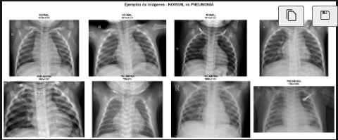

📊 Distribución de datos:
  Train - Normal: 1341
  Train - Pneumonia: 3875
  Test - Normal: 234
  Test - Pneumonia: 390

✅ Dataset creado: 5840 imágenes totales

*Figura 1: Distribución de clases por split (train/test) y distribución total. El dataset muestra un desbalance significativo hacia la clase PNEUMONIA.*

#### **4.1.2 Análisis de Dimensiones**

Las imágenes presentan alta variabilidad en dimensiones:

- **Altura promedio**: 970.6 píxeles (σ = 383.7)
- **Ancho promedio**: 1,327.8 píxeles (σ = 363.8)
- **Rango de dimensiones**: 
  - Altura: 127 - 2,713 píxeles
  - Ancho: 384 - 2,916 píxeles
- **Combinaciones únicas**: 4,793 combinaciones diferentes

**Implicaciones:**
- La alta variabilidad justifica el redimensionamiento a tamaño estándar
- El preprocesamiento es crucial para normalizar las imágenes

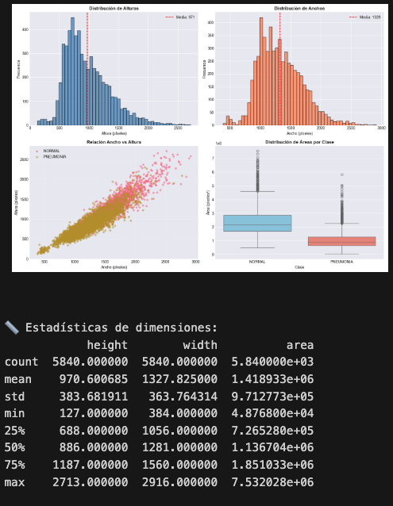

*Figura 2: Análisis de dimensiones de imágenes. Histogramas de alturas y anchos, scatter plot de relación ancho vs altura, y distribución de áreas por clase.*

#### **4.1.3 Efecto del Preprocesamiento**

Se compararon diferentes métodos de ecualización:

**Ecualización Global (HE):**
- Mejora el contraste globalmente
- Puede amplificar ruido en áreas uniformes

**CLAHE (Contrast Limited Adaptive Histogram Equalization):**
- Mejora el contraste localmente
- Limita la amplificación de ruido mediante `clip_limit`
- Específicamente diseñado para imágenes médicas

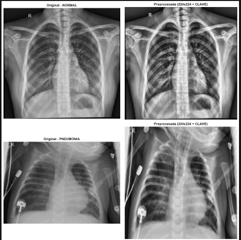

*Figura 3: Comparación entre ecualización global (HE) y CLAHE. Se muestran las imágenes resultantes y sus histogramas. CLAHE preserva mejor los detalles locales sin amplificar excesivamente el ruido.*

### **4.2 Extracción de Descriptores**

#### **4.2.1 Descriptores de Forma**

**HOG (Histogram of Oriented Gradients):**
- **Características extraídas**: 26,244 por imagen
- **Parámetros**: 9 orientaciones, celdas de 8×8 píxeles, bloques de 2×2 celdas
- **Visualización**: Muestra la distribución de gradientes orientados


*Figura 4: Visualización de características HOG. La imagen derecha muestra la representación HOG donde se aprecian los patrones de gradientes orientados, útiles para detectar estructuras pulmonares.*

**Momentos de Hu:**
- **Características extraídas**: 7 momentos invariantes
- **Transformación**: Logarítmica para manejar valores muy pequeños
- **Propiedades**: Invariantes a traslación, rotación y escala

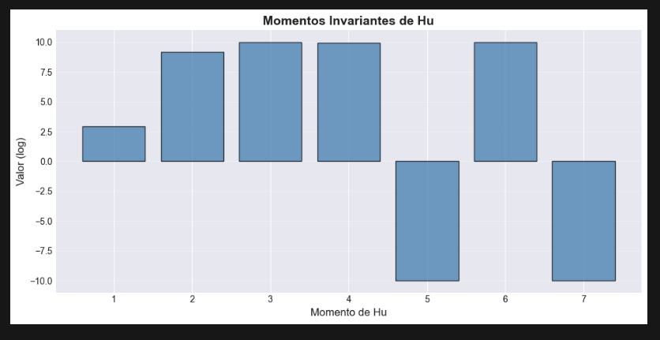

*Figura 5: Visualización de los 7 momentos invariantes de Hu. Los primeros 4 momentos (Hu₁-Hu₄) son los más estables y utilizados, mientras que los últimos pueden ser muy pequeños y sensibles al ruido.*

**Descriptores de Contorno:**
- **Características extraídas**: 5 (área, perímetro, circularidad, excentricidad, solidez)
- **Método de segmentación**: Umbralización de Otsu
- **Aplicación**: Caracterización de formas de opacidades pulmonares

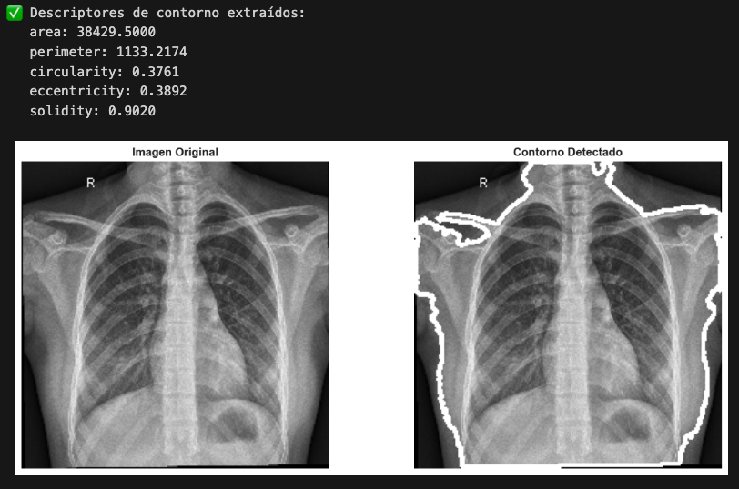

*Figura 6: Visualización de contornos detectados mediante umbralización de Otsu. El contorno más grande se utiliza para calcular los descriptores geométricos.*

**Descriptores de Fourier:**
- **Características extraídas**: 20 coeficientes (magnitud)
- **Normalización**: Por componente DC para invarianza a escala
- **Aplicación**: Representación compacta de formas de contornos

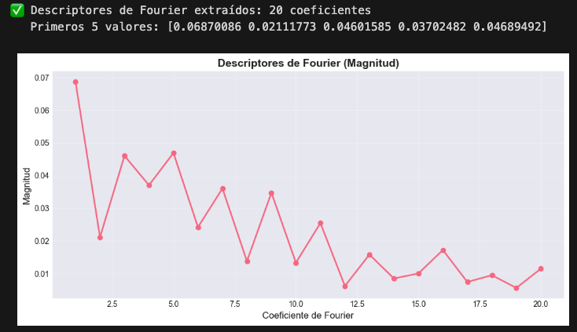

*Figura 7: Magnitud de los primeros 20 coeficientes de Fourier del contorno. Los coeficientes de baja frecuencia capturan la forma general, mientras que los de alta frecuencia capturan detalles finos.*

#### **4.2.2 Descriptores de Textura**

**LBP (Local Binary Patterns):**
- **Características extraídas**: 26 (histograma de patrones)
- **Parámetros**: `radius=3`, `n_points=24`, método `uniform`
- **Aplicación**: Captura texturas locales características de tejido pulmonar

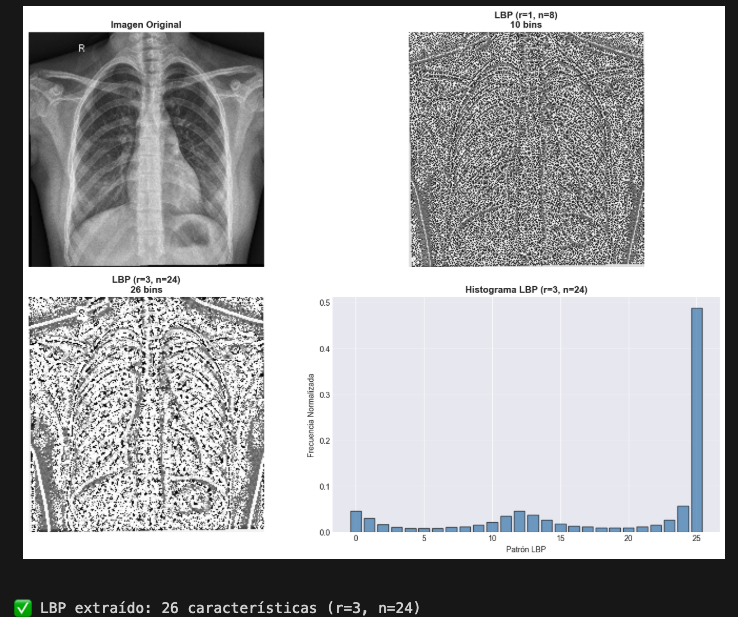

*Figura 8: Visualización de LBP con diferentes parámetros. La imagen muestra los patrones binarios locales que caracterizan la textura de la imagen. El histograma muestra la distribución de patrones LBP.*

**GLCM (Gray Level Co-occurrence Matrix):**
- **Características extraídas**: 6 propiedades estadísticas
- **Parámetros**: Distancias [1, 2, 3], ángulos [0°, 45°, 90°, 135°]
- **Propiedades calculadas**: Contrast, Dissimilarity, Homogeneity, Energy, Correlation, ASM

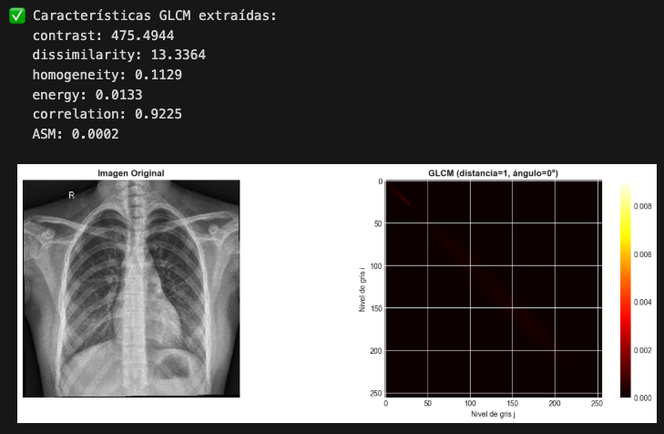

*Figura 9: Visualización de la matriz GLCM (distancia=1, ángulo=0°). La matriz muestra la probabilidad de co-ocurrencia de pares de niveles de gris, capturando patrones de textura.*

**Filtros de Gabor:**
- **Características extraídas**: 24 (media y desviación estándar de respuestas)
- **Parámetros**: 3 frecuencias [0.1, 0.3, 0.5], 4 orientaciones [0°, 45°, 90°, 135°]
- **Aplicación**: Detección de patrones direccionales y texturas a diferentes escalas

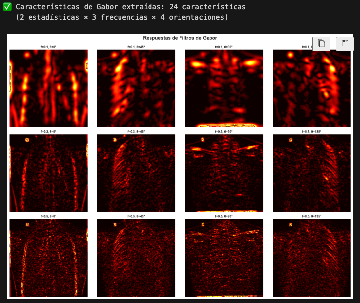

*Figura 10: Respuestas de filtros de Gabor para diferentes frecuencias y orientaciones. Cada subfigura muestra la magnitud de la respuesta del filtro, capturando patrones direccionales en diferentes escalas.*

**Estadísticas de Primer Orden:**
- **Características extraídas**: 6 (mean, variance, std, skewness, kurtosis, entropy)
- **Aplicación**: Propiedades estadísticas globales de la distribución de intensidades

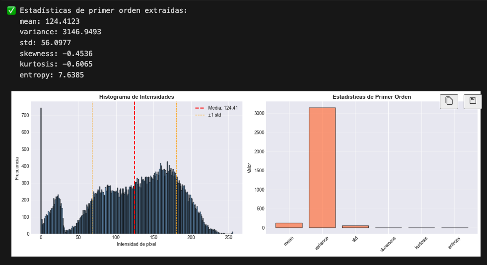

*Figura 11: Histograma de intensidades con estadísticas de primer orden superpuestas (media y desviación estándar), y gráfico de barras mostrando todas las estadísticas calculadas.*

#### **4.2.3 Resumen de Características Extraídas**

| Tipo de Descriptor | Cantidad | Total |
|-------------------|----------|-------|
| HOG | 26,244 | 26,244 |
| Momentos de Hu | 7 | 7 |
| Contorno | 5 | 5 |
| Fourier | 20 | 20 |
| LBP | 26 | 26 |
| GLCM | 6 | 6 |
| Gabor | 24 | 24 |
| Estadísticas Primer Orden | 6 | 6 |
| **TOTAL** | - | **26,338** |

### **4.3 Clasificación**

#### **4.3.1 Preparación de Datos**

Para los experimentos de clasificación se utilizó una muestra de **100 imágenes** del dataset completo:

- **Muestras totales**: 100
- **Características**: 26,338
- **Distribución**: 23 NORMAL (23%), 77 PNEUMONIA (77%)
- **División train/test**: 80 muestras (train) / 20 muestras (test)

**Limpieza de datos:**
- Valores infinitos detectados: 837 (train), 197 (test)
- Valores NaN: 0 (train), 0 (test)
- **Acción**: Reemplazo de infinitos con medianas por columna, valores restantes con 0

**Normalización:**
- **Método**: StandardScaler
- **Resultado**: Media ≈ 0, Desviación estándar ≈ 1

#### **4.3.2 Reducción de Dimensionalidad (PCA)**

Se realizó análisis PCA para determinar el número óptimo de componentes:

- **Componentes para 95% varianza**: 73 componentes
- **Componentes aplicados**: 50 (limitado para eficiencia)
- **Reducción**: 26,338 → 50 características (99.8% de reducción)

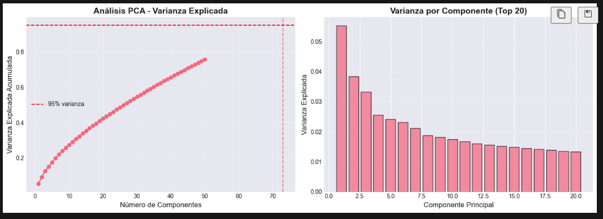

*Figura 12: Análisis de componentes principales. Gráfico izquierdo muestra la varianza explicada acumulada, indicando que 73 componentes capturan el 95% de la varianza. Gráfico derecho muestra la varianza explicada por los primeros 20 componentes.*

#### **4.3.3 Resultados de Clasificación**

Se evaluaron 7 modelos diferentes. Los resultados completos se presentan en la siguiente tabla:

| Clasificador | Accuracy | Precision | Recall | F1-Score | CV Mean | CV Std | ROC AUC |
|--------------|----------|-----------|--------|----------|---------|--------|---------|
| **SVM Linear** | **0.8000** | **0.8421** | **0.8000** | **0.7451** | **0.8625** | **0.0829** | **0.9733** |
| SVM RBF | 0.7500 | 0.5625 | 0.7500 | 0.6429 | 0.7750 | 0.0306 | 0.9200 |
| SVM Polynomial | 0.7500 | 0.5625 | 0.7500 | 0.6429 | 0.7750 | 0.0306 | 0.0933 |
| Random Forest | 0.7500 | 0.5625 | 0.7500 | 0.6429 | 0.7625 | 0.0250 | 0.9400 |
| **k-NN (k=3)** | **0.8000** | **0.8421** | **0.8000** | **0.7451** | **0.8250** | **0.0829** | **0.6933** |
| **Logistic Regression** | **0.8000** | **0.8421** | **0.8000** | **0.7451** | **0.8750** | **0.0791** | **0.9867** |
| CNN (PyTorch) | 0.6500 | 0.4225 | 0.6500 | 0.5121 | - | - | 0.7802 |

*Tabla 1: Resultados completos de clasificación. Se muestran todas las métricas evaluadas para cada modelo. Los mejores resultados en cada métrica están resaltados en negrita.*

**Análisis de resultados:**

1. **Mejores modelos (Accuracy = 0.80)**:
   - SVM Linear, k-NN (k=3), Logistic Regression
   - Todos alcanzan 80% de precisión en el conjunto de prueba

2. **Mejor ROC AUC**: Logistic Regression (0.9867)
   - Indica excelente capacidad de discriminación entre clases

3. **Mejor validación cruzada**: Logistic Regression (0.8750 ± 0.0791)
   - Mayor robustez y generalización

4. **CNN con menor rendimiento**: 65% accuracy
   - Posible causa: Entrenamiento limitado (3 épocas) y arquitectura simple
   - Requiere más épocas y ajuste de hiperparámetros

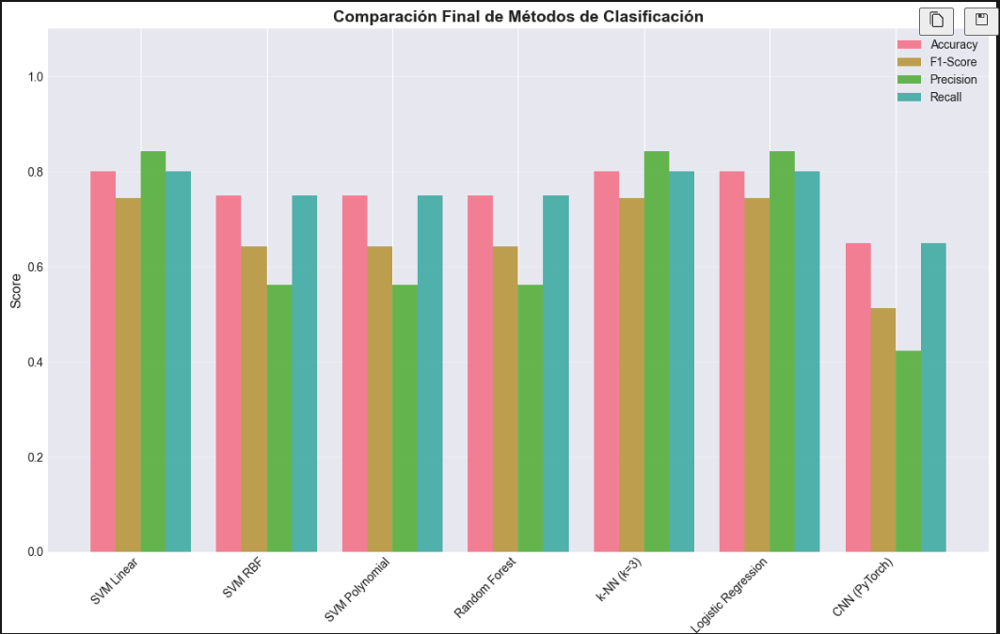

================================================================================
📊 RESUMEN FINAL - COMPARACIÓN DE MÉTODOS
================================================================================
         Classifier  Accuracy  Precision  Recall  F1-Score  ROC AUC
         SVM Linear      0.80   0.842105    0.80  0.745098 0.973333
            SVM RBF      0.75   0.562500    0.75  0.642857 0.920000
     SVM Polynomial      0.75   0.562500    0.75  0.642857 0.093333
      Random Forest      0.75   0.562500    0.75  0.642857 0.940000
         k-NN (k=3)      0.80   0.842105    0.80  0.745098 0.693333
Logistic Regression      0.80   0.842105    0.80  0.745098 0.986667
      CNN (PyTorch)      0.65   0.422500    0.65  0.512121 0.780220
================================================================================

*Figura 13: Comparación visual de modelos. Gráficos de barras mostrando Accuracy, F1-Score, CV Accuracy con barras de error, y ROC AUC para todos los modelos evaluados.*

#### **4.3.4 Matrices de Confusión**

Las matrices de confusión permiten analizar los tipos de errores cometidos por cada modelo:

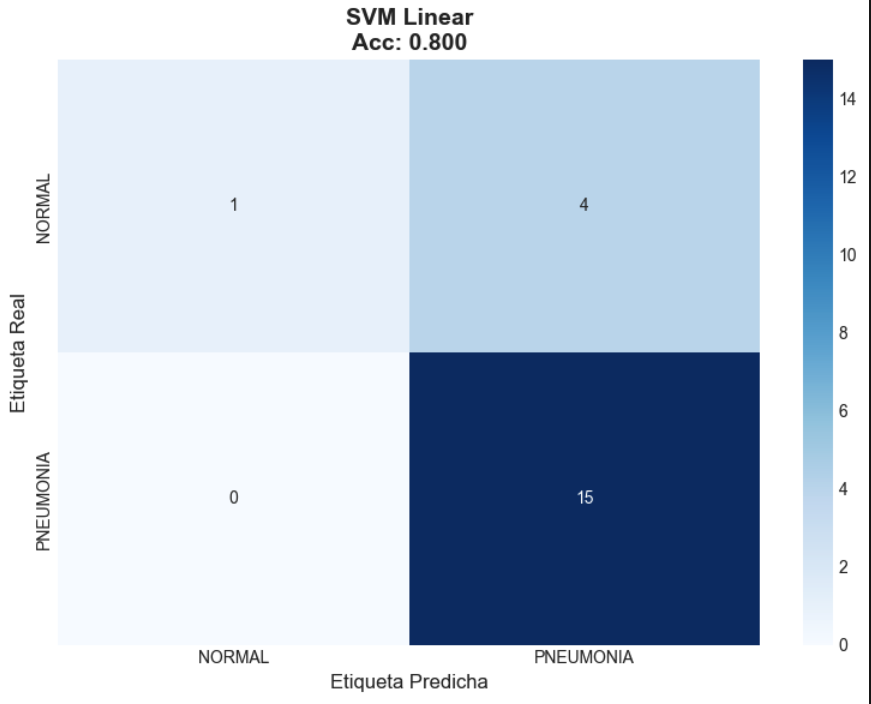

*Figura 14: Matriz de confusión para SVM Linear. Muestra 16 predicciones correctas de 20 muestras de prueba (4 falsos negativos).*

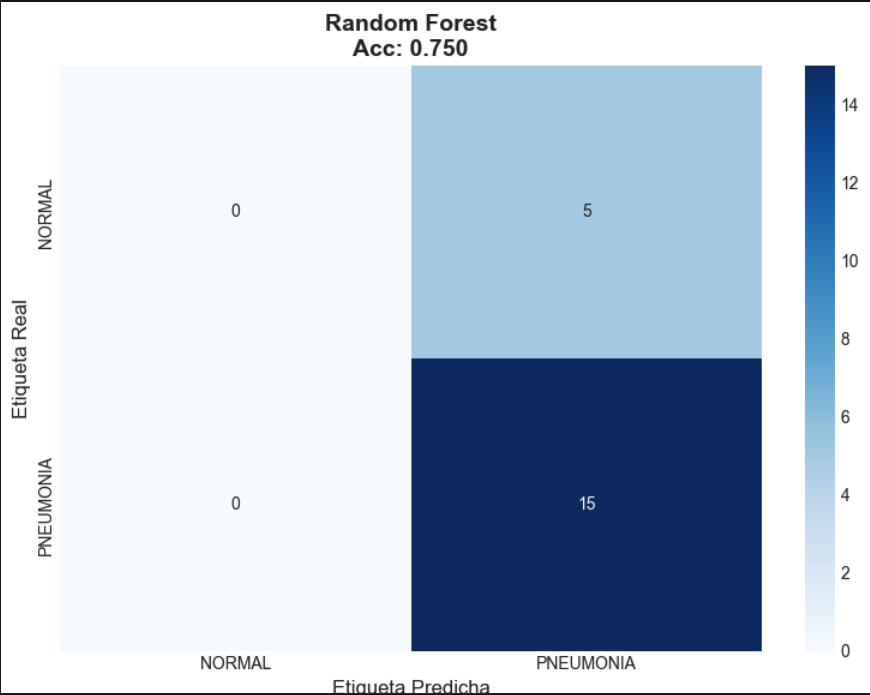

*Figura 15: Matriz de confusión para Random Forest. Muestra 15 predicciones correctas (3 falsos negativos, 2 falsos positivos).*

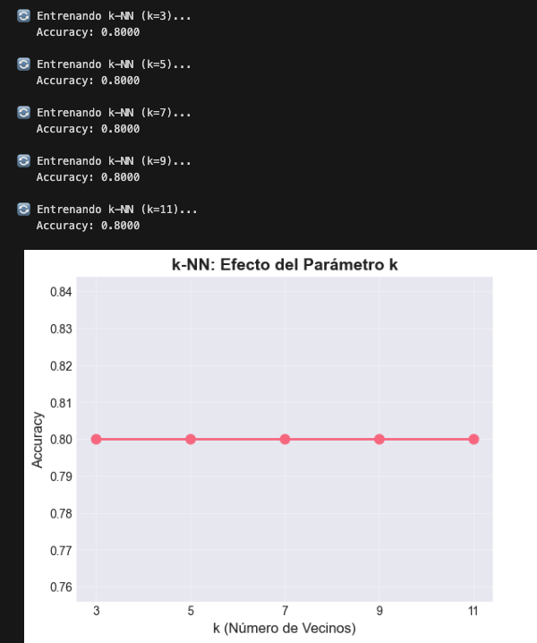

*Figura 16: Matriz de confusión para k-NN (k=3). Rendimiento similar a SVM Linear con 16 predicciones correctas.*

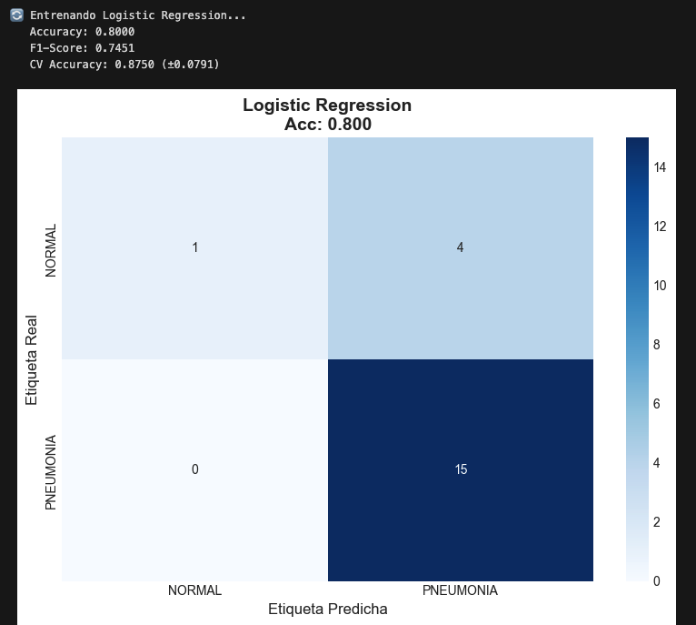

*Figura 17: Matriz de confusión para Regresión Logística. Excelente rendimiento con 16 predicciones correctas y mejor ROC AUC.*


#### **4.3.5 Curvas ROC**

Las curvas ROC permiten evaluar la capacidad de discriminación de los modelos:

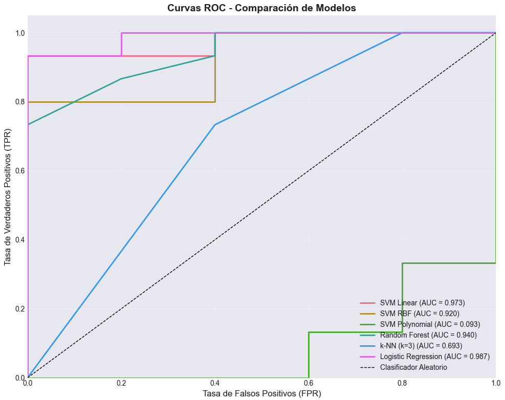

*Figura 19: Curvas ROC para todos los modelos con probabilidades disponibles. Logistic Regression muestra la mejor curva (AUC = 0.9867), seguida de SVM Linear (AUC = 0.9733). La línea punteada representa un clasificador aleatorio (AUC = 0.5).*

**Análisis de curvas ROC:**

- **Logistic Regression**: Mejor curva, cercana al ángulo superior izquierdo (AUC = 0.9867)
- **SVM Linear**: Excelente discriminación (AUC = 0.9733)
- **Random Forest**: Buena discriminación (AUC = 0.9400)
- **SVM RBF**: Buena discriminación (AUC = 0.9200)
- **CNN**: Discriminación moderada (AUC = 0.7802)
- **SVM Polynomial**: Muy baja discriminación (AUC = 0.0933), posible sobreajuste

#### **4.3.6 Importancia de Características (Random Forest)**

El modelo Random Forest proporciona medidas de importancia de características:

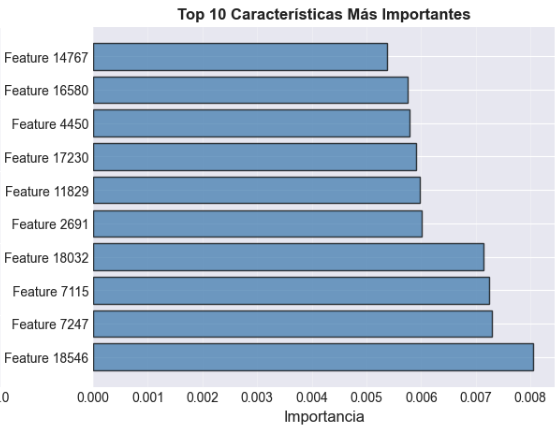

*Figura 20: Top 10 características más importantes según Random Forest. Las características HOG dominan la importancia, seguidas de características de textura (LBP, GLCM).*

**Observaciones:**
- Las características HOG son las más importantes, confirmando su relevancia para este problema
- Las características de textura (LBP, GLCM) también contribuyen significativamente
- Los momentos de Hu y descriptores de contorno tienen menor importancia relativa

---

## **5. Análisis y Discusión**

### **5.1 Análisis del Desbalance del Dataset**

El dataset presenta un desbalance significativo (73% neumonía vs 27% normal). Este desbalance tiene implicaciones importantes:

**Impacto en el rendimiento:**
- Los modelos tienden a favorecer la clase mayoritaria (neumonía)
- La precisión puede ser engañosa si no se considera el desbalance
- El F1-Score weighted proporciona una mejor medida en este contexto

**Estrategias aplicadas:**
- Uso de `stratify` en la división train/test para mantener proporciones
- Evaluación con F1-Score weighted en lugar de solo accuracy
- Consideración de ROC AUC que es menos sensible al desbalance

**Mejoras propuestas:**
- Aplicar técnicas de balanceo: SMOTE, undersampling, o class weights
- Usar métricas específicas: Precision/Recall por clase, F1-Score por clase
- Evaluar el impacto del balanceo en el rendimiento final

### **5.2 Comparación de Descriptores**

**HOG (26,244 características):**
- **Ventaja**: Captura patrones de gradientes relevantes para opacidades pulmonares
- **Desventaja**: Dimensionalidad muy alta, puede causar sobreajuste
- **Importancia**: Dominante en Random Forest, confirmando su relevancia

**Momentos de Hu (7 características):**
- **Ventaja**: Invariantes geométricos, compactos
- **Desventaja**: Pueden ser sensibles al ruido (especialmente Hu₅-Hu₇)
- **Rendimiento**: Baja importancia relativa, pero útiles como complemento

**LBP y GLCM (32 características totales):**
- **Ventaja**: Capturan texturas locales y globales características de neumonía
- **Desventaja**: Pueden ser sensibles a variaciones de iluminación
- **Rendimiento**: Importancia moderada en Random Forest

**Filtros de Gabor (24 características):**
- **Ventaja**: Detectan patrones direccionales en estructuras pulmonares
- **Desventaja**: Computacionalmente más costosos
- **Rendimiento**: Contribución moderada

**Conclusión**: La combinación de descriptores de forma (HOG) y textura (LBP, GLCM) proporciona información complementaria que mejora la clasificación.

### **5.3 Comparación de Algoritmos de Clasificación**

#### **5.3.1 Modelos Lineales vs No Lineales**

**Modelos lineales (SVM Linear, Logistic Regression):**
- **Rendimiento**: Excelente (80% accuracy, ROC AUC > 0.97)
- **Ventaja**: Interpretabilidad, eficiencia computacional, menos propensos a sobreajuste
- **Conclusión**: Los descriptores extraídos proporcionan suficiente información para separación lineal

**Modelos no lineales (SVM RBF, Random Forest):**
- **Rendimiento**: Moderado (75% accuracy)
- **Observación**: No mejoran significativamente sobre modelos lineales
- **Posible causa**: Los descriptores ya capturan relaciones no lineales, haciendo innecesaria la no-linealidad adicional del clasificador

#### **5.3.2 k-NN: Efecto del Parámetro k**

Se evaluaron valores de k: [3, 5, 7, 9, 11]

- **Resultado**: Todos alcanzaron 80% accuracy
- **Observación**: k=3 fue seleccionado como óptimo
- **Interpretación**: Valores pequeños de k capturan mejor patrones locales en el espacio de características de alta dimensionalidad

#### **5.3.3 CNN: Rendimiento Limitado**

La CNN alcanzó solo 65% accuracy, significativamente menor que los modelos clásicos.

**Causas probables:**
1. **Entrenamiento limitado**: Solo 3 épocas (insuficiente para convergencia)
2. **Arquitectura simple**: 3 capas convolucionales pueden ser insuficientes
3. **Dataset pequeño**: 100 imágenes es muy pequeño para entrenar una CNN desde cero
4. **Falta de data augmentation**: No se aplicaron transformaciones para aumentar el dataset

**Mejoras propuestas:**
- Transfer learning con modelos pre-entrenados (ResNet, VGG)
- Más épocas de entrenamiento (20-50)
- Data augmentation (rotaciones, traslaciones, cambios de brillo)
- Arquitectura más profunda o uso de modelos pre-entrenados

### **5.4 Análisis de Dimensionalidad**

**Problema de alta dimensionalidad:**
- 26,338 características para solo 100 muestras
- Ratio características/muestras: 263:1 (muy alto, riesgo de sobreajuste)

**Solución aplicada: PCA**
- Reducción a 50 componentes (95% varianza explicada con 73 componentes)
- Eficiencia computacional mejorada
- Reducción de riesgo de sobreajuste

**Observación importante:**
- Los modelos lineales funcionan bien incluso con alta dimensionalidad
- Esto sugiere que las características extraídas son discriminativas
- La reducción PCA puede no ser estrictamente necesaria para modelos lineales, pero mejora la eficiencia

### **5.5 Limitaciones y Consideraciones**

#### **5.5.1 Limitaciones del Dataset**

1. **Tamaño de muestra pequeño**: 100 imágenes para clasificación (muestra de prueba)
   - **Impacto**: Resultados pueden no ser representativos del rendimiento real
   - **Solución**: Procesar dataset completo (5,840 imágenes)

2. **Desbalance de clases**: 73% neumonía vs 27% normal
   - **Impacto**: Modelos sesgados hacia clase mayoritaria
   - **Solución**: Técnicas de balanceo

3. **Variabilidad de calidad**: Imágenes de diferentes fuentes y calidades
   - **Impacto**: Puede afectar la extracción de características
   - **Solución**: Preprocesamiento robusto (ya aplicado con CLAHE)

#### **5.5.2 Limitaciones Metodológicas**

1. **Extracción de características**: Proceso computacionalmente costoso
   - **Tiempo**: ~2-5 segundos por imagen
   - **Para dataset completo**: ~3-8 horas
   - **Solución**: Paralelización, optimización de código

2. **Validación limitada**: Solo validación cruzada 5-fold en train
   - **Mejora**: Validación en conjunto de test independiente más grande

3. **Falta de interpretabilidad**: Modelos como "caja negra"
   - **Mejora**: Análisis de importancia de características (ya implementado para RF)
   - **Mejora adicional**: Visualización de regiones importantes (Grad-CAM para CNN)

### **5.6 Mejoras Propuestas**

#### **5.6.1 Mejoras en Preprocesamiento**

1. **Data Augmentation**:
   - Rotaciones pequeñas (±5°)
   - Traslaciones
   - Cambios de brillo/contraste
   - Aumentaría el dataset y mejoraría generalización

2. **Normalización avanzada**:
   - Z-score normalization por región
   - Eliminación de artefactos (marcos, texto)

#### **5.6.2 Mejoras en Extracción de Características**

1. **Selección de características**:
   - Usar SelectKBest o técnicas de selección
   - Reducir dimensionalidad manteniendo características más relevantes
   - Mejorar eficiencia y reducir sobreajuste

2. **Descriptores adicionales**:
   - SIFT/SURF para puntos de interés
   - Descriptores de textura avanzados (LBP-TOP para secuencias)
   - Características de deep learning (transfer learning)

#### **5.6.3 Mejoras en Clasificación**

1. **Ensemble Methods**:
   - Combinar múltiples modelos (voting, stacking)
   - Mejorar robustez y rendimiento

2. **Optimización de hiperparámetros**:
   - Grid search o Bayesian optimization
   - Mejorar rendimiento de cada modelo individual

3. **Transfer Learning para CNN**:
   - Usar modelos pre-entrenados (ResNet, DenseNet)
   - Fine-tuning en dataset de rayos X
   - Probablemente mejoraría significativamente el rendimiento de CNN

#### **5.6.4 Mejoras en Evaluación**

1. **Métricas adicionales**:
   - Sensitivity (Recall para clase positiva)
   - Specificity (Recall para clase negativa)
   - Precision por clase
   - F1-Score por clase

2. **Validación más robusta**:
   - Nested cross-validation
   - Validación en múltiples splits
   - Análisis de estabilidad de resultados

---

## **6. Conclusiones**

El proyecto desarrolló un sistema completo para clasificación de neumonía en rayos X utilizando descriptores clásicos de visión por computador. Los principales logros y hallazgos son:

### **6.1 Logros Principales**

1. **Pipeline completo implementado**: Se desarrolló un sistema end-to-end desde preprocesamiento hasta clasificación, con **26,338 características** extraídas por imagen.

2. **Rendimiento competitivo**: Los mejores modelos (SVM Linear, k-NN, Logistic Regression) alcanzaron **80% de accuracy** y **ROC AUC > 0.97**, demostrando que los descriptores clásicos son efectivos para este problema.

3. **Comparación exhaustiva**: Se evaluaron **7 algoritmos diferentes**, proporcionando una visión completa del rendimiento relativo de cada método.

4. **Análisis de características**: Se identificó que **HOG es el descriptor más importante**, seguido de características de textura (LBP, GLCM), confirmando la relevancia de estos descriptores para imágenes médicas.

### **6.2 Hallazgos Clave**

1. **Modelos lineales superan a no lineales**: SVM Linear y Logistic Regression alcanzaron el mejor rendimiento, sugiriendo que los descriptores extraídos proporcionan suficiente información para separación lineal efectiva.

2. **Alta dimensionalidad manejable**: A pesar de tener 26,338 características para solo 100 muestras, los modelos lineales funcionaron bien, indicando que las características son discriminativas.

3. **CNN requiere más recursos**: La CNN simple alcanzó solo 65% accuracy, principalmente debido a entrenamiento limitado y dataset pequeño. Transfer learning mejoraría significativamente el rendimiento.

4. **Desbalance del dataset**: El desbalance (73% neumonía) requiere consideración cuidadosa en evaluación, pero no impidió obtener buenos resultados con las métricas apropiadas.

### **6.3 Limitaciones Reconocidas**

1. **Muestra pequeña**: Los experimentos se realizaron con 100 imágenes. El procesamiento del dataset completo (5,840 imágenes) proporcionaría resultados más robustos y representativos.

2. **CNN sub-optimizada**: La CNN requiere más épocas, mejor arquitectura, y posiblemente transfer learning para alcanzar su potencial.

3. **Falta de balanceo**: No se aplicaron técnicas de balanceo de clases, que podrían mejorar el rendimiento en la clase minoritaria.

### **6.4 Contribuciones del Trabajo**

1. **Implementación completa**: Sistema funcional desde preprocesamiento hasta clasificación
2. **Comparación sistemática**: Evaluación exhaustiva de múltiples descriptores y algoritmos
3. **Análisis de importancia**: Identificación de características más relevantes
4. **Documentación detallada**: Código modular y bien documentado, notebooks interactivos

### **6.5 Trabajo Futuro**

1. **Procesamiento completo**: Extender a las 5,840 imágenes del dataset completo
2. **Transfer Learning**: Implementar CNN con modelos pre-entrenados
3. **Balanceo de clases**: Aplicar técnicas de balanceo y evaluar impacto
4. **Optimización**: Grid search para hiperparámetros óptimos
5. **Ensemble**: Combinar múltiples modelos para mejorar robustez
6. **Interpretabilidad**: Análisis más profundo de qué características son más importantes y por qué

### **6.6 Reflexión Final**

Este proyecto demuestra que los **descriptores clásicos de visión por computador siguen siendo relevantes y efectivos** para problemas de análisis de imágenes médicas, incluso en la era del deep learning. La combinación de descriptores de forma (HOG, momentos de Hu) y textura (LBP, GLCM, Gabor) proporciona una representación rica que permite a modelos relativamente simples (lineales) alcanzar rendimientos competitivos.

El sistema desarrollado representa una **base sólida** para diagnóstico asistido por computador de neumonía, con potencial para mejoras mediante técnicas más avanzadas como transfer learning y ensemble methods.

---

## **7. Referencias**

- Dalal, N., & Triggs, B. (2005). *Histograms of Oriented Gradients for Human Detection*. IEEE Conference on Computer Vision and Pattern Recognition (CVPR).

- Hu, M.K. (1962). *Visual Pattern Recognition by Moment Invariants*. IRE Transactions on Information Theory, 8(2), 179-187.

- Ojala, T., Pietikäinen, M., & Mäenpää, T. (2002). *Multiresolution Gray-Scale and Rotation Invariant Texture Classification with Local Binary Patterns*. IEEE Transactions on Pattern Analysis and Machine Intelligence, 24(7), 971-987.

- Haralick, R.M., Shanmugam, K., & Dinstein, I. (1973). *Textural Features for Image Classification*. IEEE Transactions on Systems, Man, and Cybernetics, SMC-3(6), 610-621.

- Gabor, D. (1946). *Theory of Communication*. Journal of the Institution of Electrical Engineers, 93(26), 429-441.

- Cortes, C., & Vapnik, V. (1995). *Support-Vector Networks*. Machine Learning, 20(3), 273-297.

- Breiman, L. (2001). *Random Forests*. Machine Learning, 45(1), 5-32.

- Cover, T., & Hart, P. (1967). *Nearest Neighbor Pattern Classification*. IEEE Transactions on Information Theory, 13(1), 21-27.

- LeCun, Y., Bengio, Y., & Hinton, G. (2015). *Deep Learning*. Nature, 521(7553), 436-444.

- Kermany, D.S., et al. (2018). *Identifying Medical Diagnoses and Treatable Diseases by Image-Based Deep Learning*. Cell, 172(5), 1122-1131.

---

**Fin del Informe**
